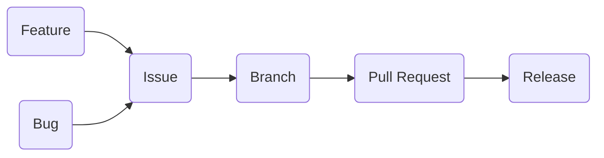

# Contribution Guidelines

## Git Guideline

- No direct pushes to `main` (restricted by GitHub);
- Development is done in `develop` branch;
- Each release is Pull Request from `develop` to `main`;
- Branch-per-issue;
- Name branches according to GitHub after issue number (Ex.: `28`);

> Most of this rules are secured by GitHub Settings of the repository. Just keep code
> simple and declarative enough.

## Code Guideline

- Docstrings are mandatory (google style);
- Remember to use linters and formatters to keep code consistent;
  - `flake8` with extensions (black compatible);
  - `black` for formatting;
  - `isort` for sorting imports (black compatible mode);
- Tests are mandatory (via `pytest`);
- Use `pre-commit` (can be setup via `Makefile`);
