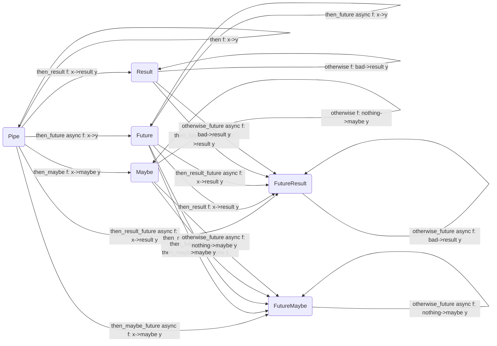

# mona

`mona` is an ASGI server framework that provides a set of guidelines on software
development inspired by functional programming and monads. It's core design is
hugely inspired by Finite State Machines and Railroad Architecture approach.

## 🤔 Motivation

Before we dive into examples and feature explanation I want to explain
motivation behind the project. There are multiple statements I had in mind so
let's check some of my thoughts.

### There is always right way to write a function

One very important thing about function we have is it's interface which we often
think not much of. I believe there are a few ideas you should follow writing
functions:

- Most important argument of the function is data that will be changed
- Most important argument must be the last one
- Best function is one that takes only one argument
- Function the requires multiple arguments should be applied partially or be HOF

> When I say "changed" I clearly understand that it's much easier to work with
> immutable data, however in Python nearly everything is mutable, but this
> "feature" is a good marker of most important argument.

This "requirements" I follow in `mona` are important for better usage of such
functional tools like _function composition_ and _curring_.

In this way all the functions must be just:

- Single-argument functions
- Higher-order functions that return single-argument functions

If we operate with single-argument functions we can apply them sequentially
(compose). In case we need to provide more than one argument we should use HOF.

🔎 Example:

```py
# ❌ this function is bad as we can't properly parametrize it for composition or
# pipeline usage.
encode = str.encode

# ✅ this function is good as it is HOF that accepts single `str` argument which
# is changed after we pass encoding key.
better_encode = lambda encoding: lambda s: return s.encode(encoding)

# also we can easier produce single-argument composition-ready functions
encode_utf_8 = better_encode("UTF-8")
```

> ⚠️ Do not use lambdas for such cases as it is harder to debug them and you
> provide no type hinting.

### Computer should do only what programmer asked

Developers love using frameworks that get rid of underlying details of
implementation and provide friendly interface for solving common problems. The
only issue with this approach is that we rarely directly know what exactly is
going on and when we face some bug or problem it's hard to find out whether it
is actual bug or feature that we had no idea of.

IMHO ASGI specification is not something hard to grasp and understand and it is
important to understand application lifecycle and events that happen during
service execution.

In this way `mona` does nothing except what you said. If you forgot to set a
header than this is your problem, if you forgot to send a body, this is your
problem (well, `mona` does it for you actually, but that is required for
persisting successful processing path).

### Everything is monad

> Monad is a monoid in the monoidal category of endofunctors equipped with
> functor composition as its product.

This is a joke (or not), but there are multiple good reasons why to use monads
instead of some other common approaches of handling different cases in code.

**`Exception` handling** is a huge problem in many programming languages. Common
approach is try-catch (or except) expressions, that wrap code that might raise
error. But for it to work developer must inform you of `Exception`s that might
be raised and you should find and remember to handle them all or explain why you
don't handle something (at least to future-self). Code becomes much more verbose
and complex. In Python you even loose in performance (but if you care about
performance you should consider another tool). Also try-except-finally by itself
is shallow if-elif-else expression which also makes your code too complex.

Before we wen't too far let's sum up 2 problems of try-except approach:

- No explicit explanation of possible raise `Exception`s (only via docstrings)
- Code becomes to complex if we handle `Exception`s via try-except blocks

> Some of you might say that in Java for example we explicitly provide
> information about raised `Exception`s. Yes, but if it is good than why we have
> `@SneakyThrows` annotation? Because we are lazy and don't really like this
> try-catch blocks.

There is monad that handles this problem - `Result`. Concept is really simple:
if there is case when your code fails than make it explicit and return
`Success`ful `Result` and `Failure` `Result`. This might be familiar for Golang
developers with their (result, error) tuple return approach. Concept is the same
actually, implementation is different.

Let's look at the example. You might want to perform request to some external
API. Request might fail for numerous reasons and we don't want to ignore that
case. We might do something like:

```python
def get_pokemon_info(name: str) -> dict:
    """Get pokemon info from external API.

    Args:
        name (str): pokemon name.
    
    Returns:
        dict: pokemon info.
    """
    # some code here that makes a request

try:
    pokemon = get_pokemon_info("pikachu")
    ...
except Exception as e:
    print(e)
```

Pretty valid and common code, but let's look at `Result`-based implementation:

```python
def get_pokemon_info(name: str) -> Result[dict, Exception]:
    """Get pokemon info from external API.

    Args:
        name (str): pokemon name.
    
    Returns:
        Result[dict, Exception]: pokemon info or exception during request handling.
    """
    # some code here that does this

match get_pokemon_info("pikachu"):
    case Success(pokemon):
        ...
    case Failure(err):
        print(err)
```

Despite being a bit longer what we've done here is:

- We've encapsulated try-except block into function itself (or even via
  decorator)
- We've explicitly informed users of our function that it might fail

> Using `Result` can be replaced with `Union`s: `dict | Exception` and in my
> personal opinion in this specific case it is event better way.

For such small cases it might seem like an overkill, but when we build up
pipelines of handling some data with multiple "unsafe" (`Exception`-raising)
functions it really saves the world. Go to the `Result` monad section to get
more examples and details.

Another good example of using monads is `Future`. Most important use case of
`Future` IMHO is composition of sync and async functions. If we don't know if
something is awaitable or not, than we need to perform a set of checks every
time we execute a function and what is most important we can't do that in sync
scope. About `Future` monad one can read more in dedicated section.

### Be declarative means you named your child good

I'm in love with declarative code, because with that I feel myself as an author
that tells a good-written story instead of instruction for building spaceship on
toilet paper.

However most enterprise languages are imperative and decorativeness becomes just
another code style that hides all imperative instructions under well named
functions and elegant constructions.

This is the Saint Graal of `mona` underlying concepts. Code should be written as
some pipeline that tells what actually happens in the system and what we get as
a result. Monads, single-argument functions, curring are just tools that can
provide this experience in good hands.

No we are ready to get right to `mona`.

## ✨ Overview

`mona` is monad-based railroad-oriented ASGI framework. This 2 core qualities
are provided via monads and interface for building application with `Handlers`.

### Monads

Let's start with some monads that `mona` provides.

#### Future

`Future` core feature is composition of sync and async function into one async:

```python
import asyncio

from mona.monads import Future


async def async_inc(x: int) -> int:
    return x + 1


def sync_square(x: int) -> int:
    return x**2


async def main():
    # Future can be directly created from awaitable
    f = Future(async_inc(2))

    print(await f)  # 3

    # Future can be also created from present value via Future.create
    f = Future.create(3)  # create some Future from sync value

    composition = Future.compose(
        async_inc,
        async_inc,
        sync_square,
    )  # (x + 1 + 1)^2
    # composition: (int) -> Future[int] (which is nearly the same as Awaitable[int])

    # Future monad overrides `>>` operator for applying sync or async functions
    result = await (f >> composition)

    print(result)  # 25


if __name__ == "__main__":
    asyncio.run(main())

# can be run as-is
```

#### Result

`Result` is monad for functions that can be applied and return some `Success`ful
result or `Failure` result.

```python
from dataclasses import dataclass

from mona.monads.result import Failure, Result, Success


@dataclass
class User:
    id: int
    name: str
    age: int
    role: str


__users = {
    1: User(1, "John", 21, "admin"),
    2: User(2, "Maria", 40, "modetator"),
    3: User(3, "Ivan", 28, "user"),
    4: User(4, "Alex", 13, "user"),
    5: User(5, "Nicole", 19, "user"),
}


def get_user(id: int) -> Result[User, Exception]:
    match __users.get(id, None):
        case User() as user:
            return Success(user)
        case None:
            return Failure(Exception(f"No user with id: {id}"))


def user_is_moderator(user: User) -> Result[User, Exception]:
    match user:
        case User(role="modetator") as user:
            return Success(user)
        case _:
            return Failure(Exception(f"User {user.name} is not moderator!"))


def make_user_admin(user: User) -> Success[User]:
    user.role = "admin"
    return Success(user)


def update_user(user: User) -> Result[User, Exception]:
    match __users.get(user.id, None):
        case None:
            return Failure(Exception("Can't update user with id {user.id}"))
        case _:
            __users[user.id] = user
            return Success(user)


# this is complete declarative railroad use-case
def make_moderator_admin(id: int) -> Result[User, Exception]:
    # Result also overrides >> for function binding
    return get_user(id) >> user_is_moderator >> make_user_admin >> update_user


result = make_moderator_admin(1)
print(result)  # Failure(value=Exception('User John is not moderator!'))


result = make_moderator_admin(2)
print(result)  # Success(value=User(id=2, name='Maria', age=40, role='admin'))
print(__users[2])  # User(id=2, name='Maria', age=40, role='admin')

# can be run as-is
```

Code might seem verbose, but `Result` provides set of decorators like
`Result.bound`, `Result.safe`, etc. that make it easier and shorter to write
functions that user `Result`.

#### Maybe

Sometimes we are "afraid" of `None` and not `Exception`. For this reason we
provide `Maybe` monad that provides `Some` and `Nothing` containers.

```python
from typing import Any, Callable

from mona.monads.maybe import Maybe, Nothing, Some


def get_key(key: Any) -> Callable[[dict], Maybe]:
    def _get_key(dct: dict) -> Maybe:
        match dct.get(key, None):
            case None:
                return Nothing()
            case some:
                return Some(some)

    return _get_key


john_doe = {
    "id": 234,
    "name": "John Doe",
    "info": {
        "articles": [23, 2345, 3334],
        "friends": [233, 245, 265],
        "emails": {
            "main": "john_doe@example.org",
            "additional": "john_doe@recovery.org",
        },
    },
}

mary_jane = {
    "id": 33,
    "name": "Mary Jane",
    "info": {
        "articles": [10, 2345],
        "emails": {
            "main": "john_doe@example.org",
        },
    },
}


def get_addition_user_email(user: dict) -> Maybe[str]:
    return Some(user) >> get_key("info") >> get_key("emails") >> get_key("additional")


def get_user_friends(user: dict) -> Maybe[list[int]]:
    match Some(user) >> get_key("info") >> get_key("friends"):
        case Nothing():
            return Nothing()
        case Some([]):
            return Nothing()
        case friends:
            return friends


maybe = get_addition_user_email(john_doe)
print(maybe)  # Some(value='john_doe@recovery.org')

maybe = get_user_friends(john_doe)
print(maybe)  # Some(value=[233, 245, 265])

maybe = get_addition_user_email(mary_jane)
print(maybe)  # Nothing(value=None, _Nothing__instance=...)

maybe = get_user_friends(mary_jane)
print(maybe)  # Nothing(value=None, _Nothing__instance=...)

# can be run as-is
```

### Monad Interface Compatibility Map



### ASGI Handlers

This are core concepts of `mona`. Based on them entire application is just a so
called `Handler` - sync or async function that takes `BaseContext` or
`ContextError`and return `BaseContext` or `ContextError`. The simplest "Hello,
World!" server written in `mona`:

```python
import mona
from mona.handlers.body import send_body_text_async

# ASGI that return text/plain response 'Hello, World!!!" for any HTTP request
app = mona.create(
    send_body_text_async("Hello, World!!!"),
)

# run with unicorn
# 
# $ curl http://localhost:8000/
# Hello, World!!!%
```

This example provides server that return `Hello, World!!!` for any request. See
more examples in [examples folder](/examples/). Also check out full API
specification on official [Documentation
Page](https://katunilya.github.io/mona/).

> Documentation is generated via [handsdown](https://github.com/vemel/handsdown)

## ⬇️ Install

`mona` is currently at a very dynamic and stormy development stage and lacks
multiple important features, so it is not published in PyPi currently and can be
installed as raw package from GitHub directly.

I suggest using [poetry](https://github.com/python-poetry/poetry) for package
management. Having project environment setup execute:

```sh
poetry add git+https://github.com/katunilya/mona
```

Another way is to build package from source:

```sh
git clone https://github.com/katunilya/mona
cd mona
poetry build
pip install dist/mona-0.2.2.tar.gz
```

## 🏗️ Develop

Fork repository. `poetry` is required for project development as it provides
simple way of managing dependencies and environment. To setup a project run:

```sh
make setup
```

This will create and activate environment, install all required dependencies and
setup `pre-commit`.

### `Makefile`

Other `Makefile` features:

- `create_env`: create virtual environment;
- `activate_env`: activate virtual environment;
- `update_deps`: update dependencies with `poetry`;
- `deps_install_no_dev`: install all dependencies except required for
  development with `poetry`;
- `deps_install`: install all dependencies with `poetry`;
- `deps_export`: export dependencies into `requirements.txt`;
- `check_flake8`: check repository with `flake8`;
- `check_isort`: check repository with `isort`;
- `test`: run `pytest` tests;
- `check`: run all previous checks;
- `setup_pre_commit`: setup `pre-commit` hooks;
- `docs`: generate new documentation source files;
- `setup`: setup repository for development;

Now you are ready to bring your ideas to the project. Check out [Contribution
Guidelines](/CONTRIBUTING.md) for more information on project development.
